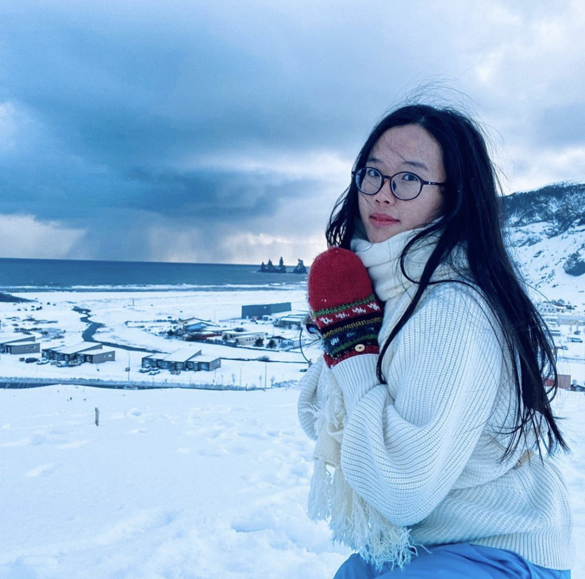

Hi, I'm a PhD student in [ALMANnaCH](https://almanach.inria.fr/index-fr.html) at Inria Paris advised by [Chloé Clavel](https://clavel.wp.imt.fr/). I'm also affiliated with DaSciM at Ecole Polytechnique. My research focuses on the evaluation and alignment of language models, particularly regarding lingusitic aspects such as linguistic diversity and multilingualism.

I completed an engineering diploma at [Ecole Polytechnique](https://www.polytechnique.edu/) and an undergraduate degree at [Shanghai Jiao Tong University](https://en.sjtu.edu.cn/). I also spent some time as an research intern at [Apple AIML](https://machinelearning.apple.com/).

I come from Beijing and have lived in New York and Shanghai before temporarily settling in Paris. I enjoy learning new languages and exploring off-the-beaten-path destinations through slow travel. I also love to paint, make pottery and write creative non fiction.

 
 

### News

* **Oct 2024**: Joined INRIA's [ALMAnaCH](https://almanach.inria.fr/index-fr.html) team for the last months of my PhD.
* **November 2024**: Our paper on benchmarking linguistic diversity in LLMs is out.
* **November 2024**: Our paper on multilinguality and naturalness in LLMs is out.
* **May 2024**: Joined **Apple AIML** for an research internship on multilingual language models.
* **August 2024**: Our paper on linguistic diversity decline was reported by the New York Times!
* **June 2024**: One paper accepted at **NAACL** Findings!
* **December 2023**: One paper accepted at **EMNLP** Findings!
* **December 2022**: One paper accepted at **EMNLP**!
* **Jul 2022**: Gave an invited talk on abstractive summarization evaluation at [Laboratoire d'Informatique de Paris Nord](https://lipn.univ-paris13.fr).
* **Feburary 2022**: Started working as a PhD researcher at Ecole Polytechnique.
* **November, 2020**: Received the "Prix du Stage de Recherche" from the Computer Science Department at École Polytechnique for my [Master's project on COVID-19 and semantic change]{https://arxiv.org/abs/2102.07836}.
